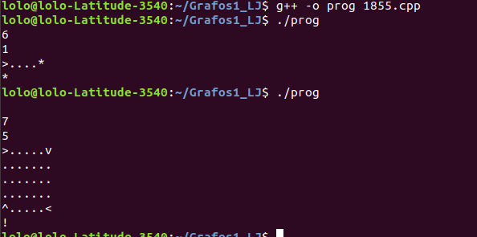
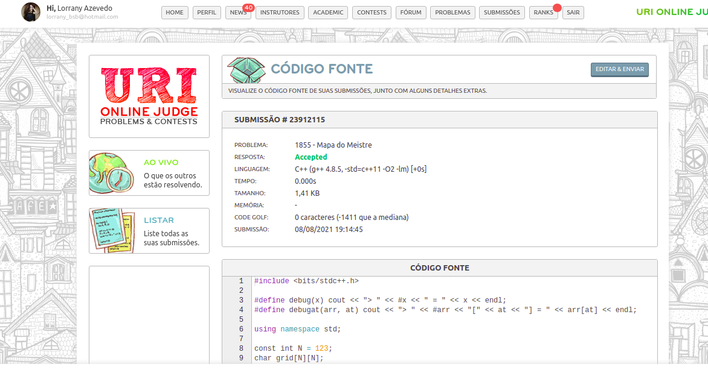

# Mapa do Meistre

**Número da Lista**: x<br>
**Conteúdo da Disciplina**: Grafos 1<br>

## Alunos
|Matrícula | Aluno |
| -- | -- |
| 17/0013651  |  João Gabriel Antunes |
| 16/0132550  |  Lorrany Azevedo |

## Sobre 
Neste projeto nós resolvemos os exercícios 1855 e 1774 do uri. 

## Screenshots



## Instalação 
**Linguagem**: C++<br>
Para rodar o projeto basta ter o compilador g++ instalado em sua máquina.

## Uso 
Para rodar o projeto basta executar os seguintes comandos no terminal:

```console
g++ -o prog 1855.cpp
./prog < input
```

e também:
```console
g++ -o prog 1774.cpp
./prog < input2
```

## Outros 
Na questão 1855 não foi seguido a forma convencional de se implementar um gráfo (com lista ou matriz adjacentes), ou seja é o que chamamos de grafo implicito, os vértices são representados pela posição atual a aresta é representada pelo ato de calcular qual a posição seguinte do meu mapa.

Na questão 1774 foi utilizado o algoritmo de kruskal, utilizando uma arvore de abrangencia mínima como estrutura de dado, além de uma estrutura básica do grafo não direcional.
